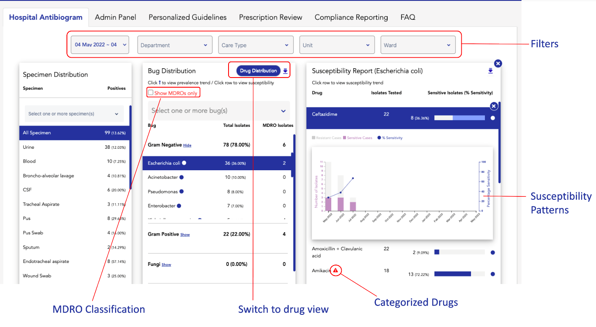

Welcome to ZEVAC - a next-gen software solution for your hospital's AMS team. ZEVAC enables an efficient Anitimicrobial Usage & Stewardship Program in hospitals by providing a complete workflow for AMS review.

:::tip
Tip: If you want to have a detailed introduction to ZEVAC, read our [Introduction to ZEVAC](../intro.md) page. Read on below, to have a quick overview
of all the features provided by ZEVAC.
:::

### Hospital Antibiogram / Cumulative Antibiogram

From the hospital antibiogram, you can perform the following actions. 
* View specimen distribution in the culture reports
* Filter data for a date-range, deparment, ward etc.
* Review bugs identified in one or more specimen and check their drug susceptibility
* Select the MDRO only view to see the MDRO distribution
* View bug-drug susceptibility patterns
* Review patterns in categorized drugs
* Toggle between a bug-based / drug-based antibiogram view

:::info Learn More

For an in-depth look at the features of the hospital antibiogram module, take a look at the **[Hospital Antibiogram](/docs/CumulativeAntibiogram/intro)** section of this guide.

:::