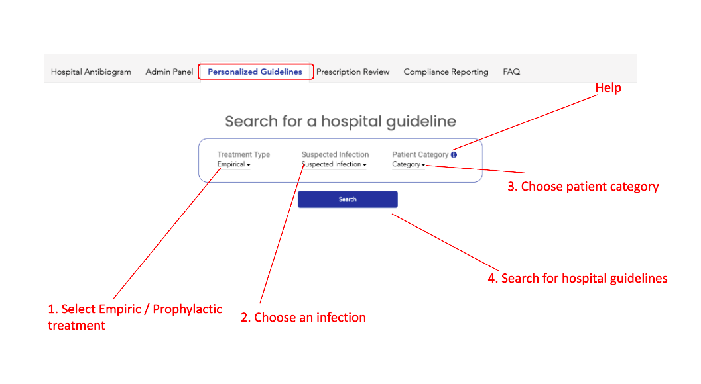
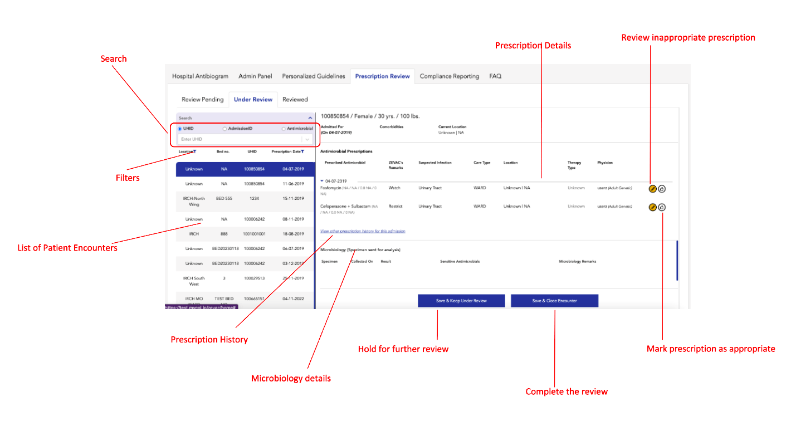

Welcome to ZEVAC - a next-gen software solution for your hospital's AMS team. ZEVAC enables an efficient Anitimicrobial Usage & Stewardship Program in hospitals by providing a complete workflow for AMS review.

:::tip
Tip: If you want to have a detailed introduction to ZEVAC, read our [Introduction to ZEVAC](../intro.md) page. Read on below, to have a quick overview
of all the features provided by ZEVAC.
:::

### Hospital Antibiogram / Cumulative Antibiogram

From the hospital antibiogram, you can perform the following actions.

- View specimen distribution in the culture reports
- Filter data for a date-range, deparment, ward etc.
- Review bugs identified in one or more specimen and check their drug susceptibility
- Select the MDRO only view to see the MDRO distribution
- View bug-drug susceptibility patterns
- Review patterns in categorized drugs
- Toggle between a bug-based / drug-based antibiogram view

### Admin Panel

From the admin panel, you can manage access to ZEVAC. Click on User Management to see the currently existing users, add a new user, enable or disable an existing user.

You can also add antimicrobials that you want to review in prescriptions. Go to the Antibiotic Categories tab to add a category / antimicrobial.

Within the ZEVAC admin panel, you can also define the infection treatment and surgical prophylaxis guidelines followed in your hospital. Once published, these guidelines will be available for the clinicians to refer when they need.
You can also upload your hospital guidelines as a PDF file or Excel document.

:::note
Admin Panel is only available for the admin user (AMS team). Clinician users can see the guidelines set by the AMS team, using the
Guidelines and Rules module.
:::

### Guidelines & Rules (Clinician User)

As a clinician user, you have access to the Guidelines & Rules module. Here, you can view all the antimicrobial categories, infection treatment and surgical prophylaxis guidelines as published by the AMS team.
You can also download the guidelines in a PDF / Excel format if uploaded by the AMS team.

### Personalized Guidelines

ZEVAC provides an easy to use search feature to find the guidelines related to a specific patient category. Click on Personalized Guidelines and then
select the therapy type, suspected infection, and patient category from the dropdowns. Click on Search to view the guidelines related to the patient category.

Click on the information icon to get help about the patient category as defined in the hospital guidelines.

### Prescription Review

The bulk of AMS workflow happens in the Prescription Review module. From the Prescription Review screen, you can:

- see a list of patient encounters with categorized antimicrobials
- search the data using UHID, admission ID or antimicrobial prescribed
- filter the data using location and date of prescription
- view all important details of a prescription
- mark a prescription as appropriate
- identify issues in the prescription and suggest alternatives to the clinicians as interventions
- view the prescription history of a patient
- view the microbiology details of a patient

### Compliance Reporting

Compliance Reporting module provides you with a summary of all the process and outcome measures of the AMS program.

:::info Learn More

For an in-depth look at using ZEVAC, take a look at the **[Hospital Antibiogram](/docs/CumulativeAntibiogram/intro)** section of this guide.

:::
