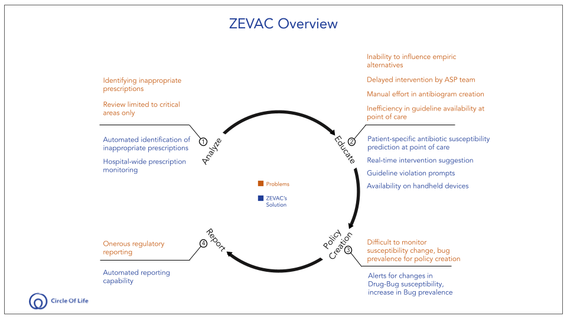

# Introduction to ZEVAC

Welcome! Let's discover ZEVAC and what it can do to help improve antimicrobial usage in your hospital. ZEVAC is a next generation antimicrobial stewardship software that aims to become an end to end solution to optimize antimicrobial usage in
hospitals and thus enable them to provide optimal health outcomes.

 provides for real time data to flow through the system and generate a stratified hospital-wide antibiogram, at the click of a button
+ provide for a fully automated guideline creation and tracking mechanism
+ provides flexibility of default WHO guidelines, which are further adapted based on individual hospital AMS leadership preferences 
+ provides actionable real time patient specific data to augment clinical decision making before culture reports become available 
+ supplements empiric prescribing / physician intuition, with AI models built and validated using 400,000+ culture reports. The model continuously adapts based on machine learning algorithms to hospital/ward specific data, and will modify suggestions as drug/bug susceptibility patterns change
+ links to existing EMR system with prior patient data sets, department/ward, diagnosis codes, LMIS, pharmacy using ready APIs for connecting with EPIC and other major EMRs (require only modest support from IT leadership)
+ extensive reporting and audit procedures, providing ease of dissemination
+ clinician friendly, designed to fit into existing workflow without multiple additional input required, to allow seamless clinician adoption

## Why do you need an AMS software?
WHO lists AMR (Antimicrobial Resistance) among the top 10 global health issues.
- In the USA one out of every two patients in a hospital is administered antibiotics and one-third of the antibiotics are inappropriate. In India we don't even have documented data for inappropriate antibiotics.
- India is the epicentre of Superbugs – Multidrug Resistant Bacteria
- UN has declared Antimicrobial (Antibiotic) Resistance as a Global Health Crisis
- HAI is one of top 3 adverse events within Hospitals
- CDC targets 100% Antimicrobial Stewardship Program (ASP) by Healthcare Providers
- JCI has made an ASP mandatory for certification to Healthcare Providers

## What ZEVAC can do?

Complete solution for an ASP workflow.
1. Analize: Review prescription practices, recommend alternates
2. Educate: Apprise clinicians regarding alternate therapy and changing susceptibility patterns
3. Policy Creation: Review Hospital-wise culture reports to generate cumulative antibiograms & guidelines
4. Report: Periodic Regulatory Reporting detailed internal policy formulation 

Zevac is a ML based AMS workflow efficiency software that enables the AMS team + ID physician to provide omnipresent support to your clinicians. Some of its functionality along with benefits are - 
Typically data is in silos within a hospital IT systems. Zevac breaks down these siloes to provide always updated Cumulative antibiogram (stratified to the level of the ward) within the hospital with intelligent alerting mechanism of –Bug Outbreaks, Drug-bug sensitivity ; Benefits – Uniform and Most update view of the bug and drug interactions for clinicians and AMS team
Augmented Individualized Antibiogram support system – Augments the clinicians antibiotics prescription capability through Machine learning based drug-bug sensitivity suggestions at the point of care at Zero Hour; Benefits – improved infection outcomes and judicious use of antibiotics
Define and disseminate always updated guideline – Antibiotics prescription guidelines invariably lag the on-ground reality of drug-bug sensitivities; Zevac changes the paradigm from reactive to near-real time proactive interventions
Monitoring – For AMS team to get a real-time view of drug usage at a case level is a herculean task and when they do get it sifting through the maze of data is a frustrating; Zevac automates the job of aggregating the data to present a single view while flagging inappropriate/ possible indiscretions
Reporting – Automated calculation of DDD/ DOT /AU/ AR to improve compliance.

## What ZEVAC can not do? (yet)
Solution doesn’t provide the following
Zevac is based on ML models that discern patterns in data – it is not a replacement of lab-generated Culture and Sensitivity report
Zevac doesn’t prescribe antibiotics it provides suggestions at an individualized level to the clinicians to augment empiric therapy. 
Zevac empowers ID physicans/AMS teams by eliminating redundant effort. The software needs their intelligence to optimize performance of the facility; doesn’t replace them

### What you'll need

- A desktop computer or laptop running Windows 7 or above / Mac OS-X 10.0.0 or higher / Linux OS
- A modern browser. We recommend the latest version of **Google Chrome** for the best experience. 

:::caution

ZEVAC is not compatible with Internet Explorer. If you choose to still use it, the application will still work. However, some features may not behave as expected.

:::